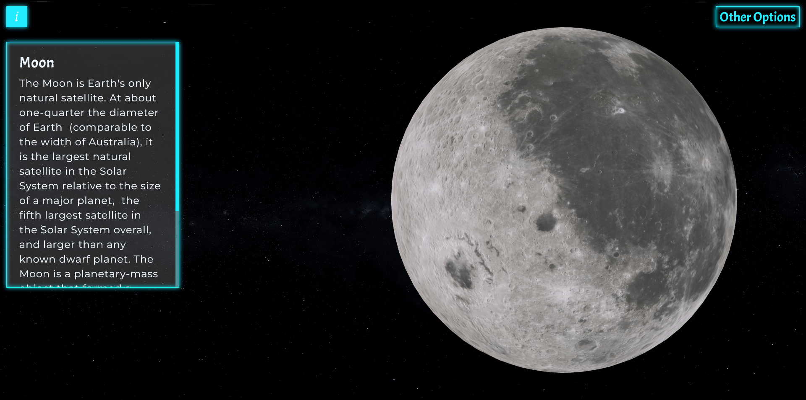
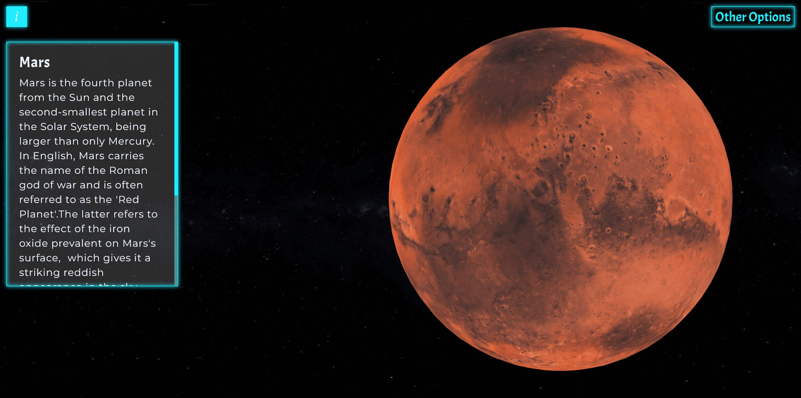

### Available Scripts

- For downloading packages, type: `yarn` or `npm install`
- For running the app in development mode, type: `yarn start` or `npm start`

### Used Technologies

- HTML
- SCSS
- React
- Three JS

### Images

### Live version

- You can access live version of this website from [here](https://planets-3d-website.netlify.app).
